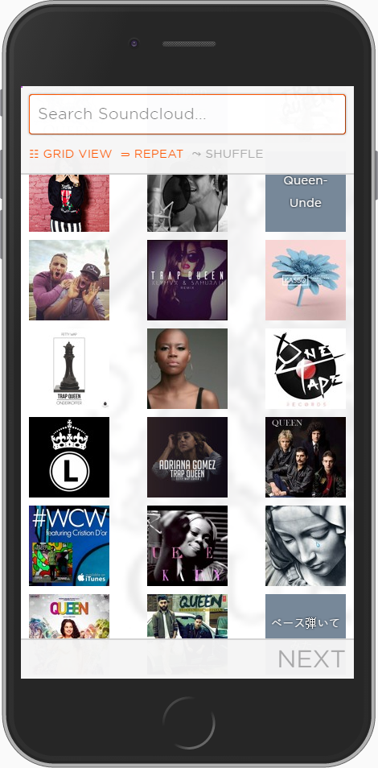

## Prerequisites
* [Node.js](https://nodejs.org/en/) (```Stable```)
* `git clone`.

## Run
Simply hit `run.bat` to view @ localhost:8000;

## Support
Please [open an issue](https://github.com/adi518/soundcloud-spa/issues) for support.


